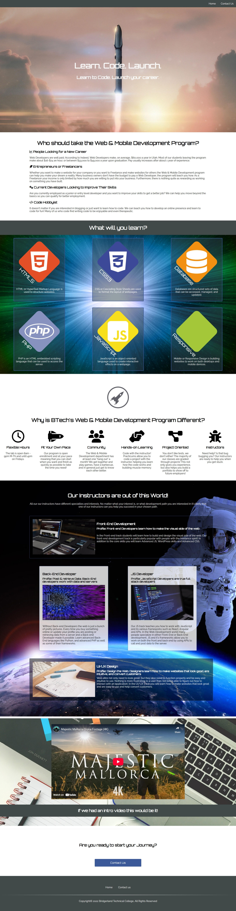

# BTech Web & Mobile Development Program Website
## Overview
I created this project as part of a code-along in my Web Development Essentials course at Briderland Technical College. I gained experience using HTML and CSS and practiced embedding content, using Font Awesome, and using Google Fonts. Currently, this website is not mobile-responsive.

## Screenshot

